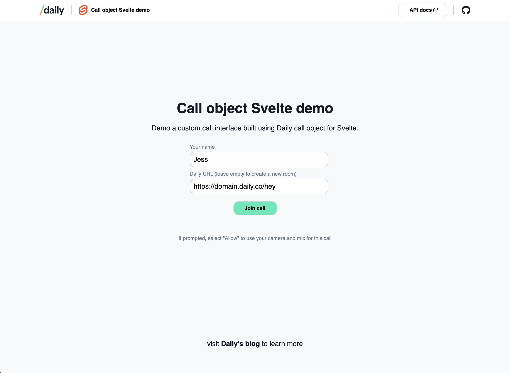
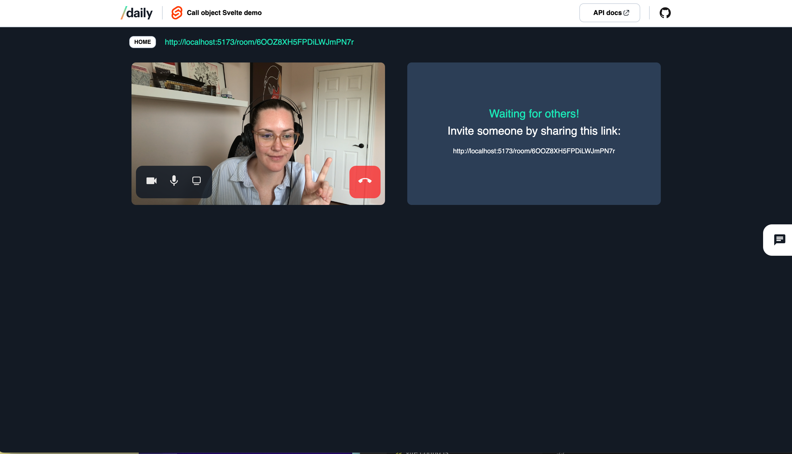

# SvelteKit + Daily call object (custom) video call demo

This project demonstrates how to build a custom video call with Daily's custom [call object](https://docs.staging.daily.co/call-object) mode using [SvelteKit](https://kit.svelte.dev/).

_Note: This demo has not been optimized for large calls. Please review our [large meeting guide](https://docs.daily.co/guides/how-daily-works/scaling-applications-to-support-large-calls) for more information or [contact us](https://www.daily.co/contact/support) for help getting your app production-ready._



---

## Getting set up with Daily

To use this demo, you will need a Daily room to join. You can either add your Daily API to your local environment or you can manually create a room through the Daily dashboard.

In either case, you will first need to [create a Daily account](https://dashboard.daily.co/signup). Once you have an account and are logged into the [Daily dashboard](https://dashboard.daily.co), do one of the following.

### 1. Add your Daily API key to your local environment

Clone this repo and rename `env.example` to `.env.local`

Add your Daily API key, which can be found on the Daily [dashboard developers page](https://dashboard.daily.co/developers). You will also need to add your Daily domain name, found in the top left corner of the dashboard.

```
VITE_DAILY_API_KEY=<-your-api-key->
VITE_DAILY_DOMAIN=<-your-daily-domain->
```

Next, follow the local development instructions below.

### 2. Manually creating a Daily room

Alternatively, you can [create a new Daily room](https://dashboard.daily.co/rooms/create) through the dashboard and enter the room URL in the app's form.

The room URL will be in the following format:

`https://<your-daily-domain>.daily.co/<room-name>`

## Local development

After cloning this repo, run the following commands from the project's root directory.

```bash
npm i
npm run dev
```

Visit `http://localhost:5173` to view the app locally.

---

## Demo features

- Creates new Daily rooms via the app UI
- Accepts existing room URLs
- Supports multi-participant video calls
- Chat messaging
  - Chat messages are saved in currently saved in local state. Persistent chat history functionality can be added but is not currently included.
- Local device controls
- In-call screen sharing (max. 1 screen)

## Daily API interactions

This demo uses the following Daily methods:

- [createCallObject()](https://docs.daily.co/reference/daily-js/factory-methods/create-call-object)
- [join()](https://docs.daily.co/reference/daily-js/instance-methods/join)
- [participants()](https://docs.daily.co/reference/daily-js/instance-methods/participants)
- [localVideo()](https://docs.daily.co/reference/daily-js/instance-methods/local-video)
- [localAudio()](https://docs.daily.co/reference/daily-js/instance-methods/local-audio)
- [setLocalVideo()](https://docs.daily.co/reference/daily-js/instance-methods/set-local-video)
- [setLocalAudio()](https://docs.daily.co/reference/daily-js/instance-methods/set-local-audio)
- [startScreenShare()](https://docs.daily.co/reference/daily-js/instance-methods/start-screen-share)
- [stopScreenShare()](https://docs.daily.co/reference/daily-js/instance-methods/stop-screen-share)
- [leave()](https://docs.daily.co/reference/daily-js/instance-methods/leave)
- [destroy()](https://docs.daily.co/reference/daily-js/instance-methods/destroy)
- [supportedBrowser()](https://docs.daily.co/reference/daily-js/static-methods/supported-browser#main)

And the following Daily events:

- [joining-meeting](https://docs.daily.co/reference/daily-js/events/meeting-events#joining-meeting)
- [joined-meeting](https://docs.daily.co/reference/daily-js/events/meeting-events#joined-meeting)
- [participant-joined](https://docs.daily.co/reference/daily-js/events/participant-events#participant-joined)
- [participant-updated](https://docs.daily.co/reference/daily-js/events/participant-events#participant-updated)
- [participant-left](https://docs.daily.co/reference/daily-js/events/participant-events#participant-left)
- [error](https://docs.daily.co/reference/daily-js/events/meeting-events#error)
- [camera-error](https://docs.daily.co/reference/daily-js/events/meeting-events#camera-error)
- [app-message](https://docs.daily.co/reference/daily-js/events/participant-events#app-message)

---

## Additional information from SvelteKit

Before creating a production version of your app, install an [adapter](https://kit.svelte.dev/docs#adapters) for your target environment. Then:

```bash
npm run build
```

> You can preview the built app with `npm run preview`, regardless of whether you installed an adapter. This should _not_ be used to serve your app in production.
